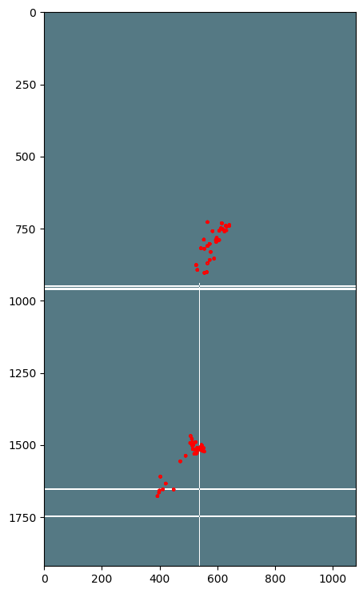

This is the framework for Badminton. 

## Usage:
```
from Badminton.Badminton import Detector
detector_object = Detector()
detector_object.detect_players_image('/Badminton/images/bad.jpg')
```

Note: Weights can be downlaoded using the download_weights.sh script in Badminton/config

## Sample Output of Detector


## Sample Output of Heatmap


