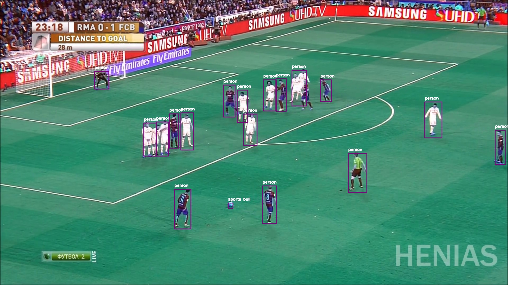

This is the framework for Badminton.

**Usage:**

from Football.Football import Detector

obj = Detector()

obj.detect\_players\_image(&#39;Football/images/sample-input.jpg&#39;)

Note: Weights can be downloaded using the download\_weights.sh script in **config** folder

## Sample Output of Detector

